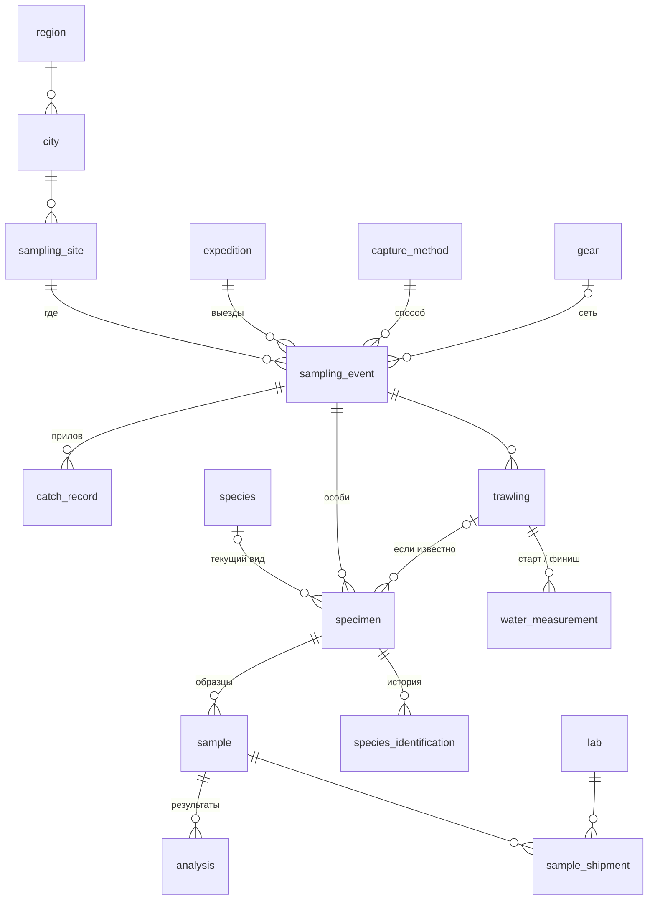

<div align="center">

# 🐟 Biobank

**Информационный банк биологических данных ихтиологических экспедиций во Вьетнам**

Полевые таблицы Excel → проверенная реляционная база SQLite → отчёты, выгрузки и безопасные правки

[](https://github.com/GordeyGudim/biobank/actions/workflows/tests.yml)


[Возможности](#возможности) •
[Схема данных](#схема-данных) •
[Установка](#1-установка) •
[Команды](#3-команды) •
[Примеры SQL](#7-примеры-sql)

</div>

---

Экспедиции 2025–2026 годов в дельту Меконга собирают сомов *Pangasius*, *Plotosus canius*
и других рыб: промеры особей, пробы на ДНК, гистологию, мазки крови, параметры воды на
каждом тралении. В поле всё это записывается в Excel — с запятыми вместо точек, числами,
которые Excel превратил в даты, комментариями к ячейкам и метками вроде «3 p.c.» или «1е»
кириллицей.

Biobank превращает такую книгу в аккуратную базу данных и **ничего не исправляет молча**:
всё спорное попадает в журнал проблем со ссылкой на лист и ячейку.

> **Полевые данные в репозиторий не входят.** Здесь — код, схема базы и тесты.
> Тесты, которым нужна исходная книга `data/source.xlsx`, без неё пропускаются.

## Возможности

| | |
|---|---|
| 📥 **Импорт** | Разбор «полевого» Excel: числа текстом, время числом, метки проб в десятке написаний, гистология по органам («26 ph a – печень, 26 ph б – почки» → два образца), комментарии к ячейкам. Одна транзакция, повторный импорт даёт ту же базу |
| 🗺️ **Места и выезды** | Место отделено от выезда: экспедиции возвращаются на те же участки. Точки рыбаков ближе 200 м объединяются |
| 🔍 **Проверки** | Промеры (SL > TL, масса без органов больше полной, длина и масса не согласуются), пропуски и повторы в сквозной нумерации, суффикс пробы против вида |
| 📋 **Журнал проблем** | Каждая находка — запись с листом, ячейкой и исходным значением. Исправили данные — запись закрывается сама |
| ✏️ **Безопасные правки** | Привязать особь к тралению, добавить определение вида (история сохраняется), закрыть проблему. Резервная копия перед каждой правкой |
| 📊 **Отчёты и выгрузка** | Отчёты по видам, образцам, воде, местам; выгрузка в Excel/CSV со сводными листами; SQL-запросы только на чтение |

```console
$ python -m biobank report species
Итого по видам (строк: 9)
┌─────────────────────────────┬──────────────┐
│ вид                         │ особей всего │
├─────────────────────────────┼──────────────┤
│ Pangasius sp.               │          210 │
│ Plotosus canius             │          173 │
│ Pangasius elongatus         │           34 │
│ Pangasianodon hypophthalmus │           26 │
│ …                           │            … │
└─────────────────────────────┴──────────────┘
```

## Схема данных



Полное описание с комментариями — [`db/schema.sql`](db/schema.sql) (18 таблиц).
Подробнее о решениях — в разделе [«Как устроены данные»](#4-как-устроены-данные).

---

## 1. Установка

Нужен Python 3.11 или новее (`python --version`). Всё ставится в виртуальное
окружение — отдельную папку `.venv` с Python и библиотеками только для этого проекта
(на Arch Linux системный `pip` вообще запрещён).

```bash
git clone https://github.com/GordeyGudim/biobank.git
cd biobank
python -m venv .venv                 # создать окружение (один раз)
source .venv/bin/activate            # включать в каждом новом терминале
pip install -e '.[dev]'              # установить проект и инструменты разработки
```

Для просмотра базы удобно поставить (Arch Linux; в других системах — аналогичные пакеты):

```bash
sudo pacman -S sqlite                # консольный sqlite3
sudo pacman -S sqlitebrowser         # DB Browser for SQLite — графическая программа
```

## 2. Быстрый старт

Положите полевую книгу в `data/source.xlsx` (в репозитории её нет), затем:

```bash
source .venv/bin/activate
python -m biobank import data/source.xlsx   # собрать базу output/biobank.db из Excel
python -m biobank check                     # сводка проблем данных
python -m biobank report species            # особи по видам и экспедициям
python -m biobank export                    # всё в Excel: output/biobank.xlsx
```

Справка по любой команде: `python -m biobank --help`, `python -m biobank identify --help`.

## 3. Команды

Все команды работают с `output/biobank.db`; другой файл — `--db путь` **перед** командой:
`python -m biobank --db копия.db report sites`.

| Команда | Что делает |
|---|---|
| `init` | создать пустую базу из `db/schema.sql` (спросит, если файл уже есть) |
| `import data/source.xlsx [--force] [-y]` | пересоздать базу и импортировать книгу (разовый перенос из Excel): новая база собирается во временном файле и сравнивается со старой; если старая отличается от Excel — отказ без `--force`; перед заменой — резервная копия старой базы; в конце — сколько чего загружено |
| `check` | запустить проверки данных, обновить журнал проблем (в транзакции `BEGIN IMMEDIATE`, как правки), вывести сводку по категориям |
| `export [--format xlsx\|csv] [--out путь]` | выгрузить всё: первый лист — журнал проблем, затем сводные листы и все таблицы |
| `report <имя>` | отчёт: `species`, `samples`, `water`, `sites`, `issues` (`--width 80` — шире колонки) |
| `sql "SELECT …"` | выполнить запрос **только на чтение** и напечатать таблицей (запись, `ATTACH`, `VACUUM INTO`, `PRAGMA … = …` запрещены; `PRAGMA integrity_check`, `foreign_key_check`, `table_info(…)` работают) |
| `show <номер>` | карточка особи: промеры, вид и история определений, образцы и лаборатории, анализы, вода выезда/траления, проблемы из журнала |
| `link-trawl <номер> <траление>` | привязать особь к тралению её же выезда |
| `identify <номер> <вид> --method … --confidence …` | добавить определение вида (история сохраняется) |
| `resolve-issue <id> "<как решили>"` | отметить проблему из журнала решённой |

Посмотреть всё об одной особи (только чтение):

```bash
python -m biobank show "155 pc"
python -m biobank show "ХХ (Точка 1)"
```

Таблицы `show`, `report` и `sql` подстраиваются под ширину окна терминала: длинный текст
переносится внутри ячейки.

Примеры правок:

```bash
python -m biobank link-trawl "5 pc" 3
python -m biobank identify "5 e" "P. elongatus" --method ДНК --confidence точно \
    --by "Иванов" --date 2026-09-15 --notes "GenBank PQ123456"
python -m biobank identify "ХХ (Точка 1)" "?" --method морфология --confidence "не определён"
python -m biobank resolve-issue 12 "Дату рынка подтвердил коллега по журналу"
```

- Номер пробы можно писать как в Excel: `5pc`, `5е` (кириллицей), `155  pc` — он нормализуется.
- Вид — полностью (`Pangasius elongatus`) или сокращённо (`P. elongatus`, `P. sp`).
  Новых видов команда не создаёт: их нужно сначала добавить в справочник `species`.
- Методы: `морфология`, `ДНК`, `другое`. Уверенность: `точно`, `предп.`, `до рода`, `не определён`.

## 4. Как устроены данные

```
region (провинция) ─< city ─< sampling_site (МЕСТО: где)
expedition ─< sampling_event (ВЫЕЗД: когда; = один лист Excel) >─ sampling_site
sampling_event ─< trawling (траление) ─< water_measurement (старт / финиш)
sampling_event ─< specimen (ОСОБЬ: TL, SL, m) ─< sample (ОБРАЗЕЦ) >─< lab (через sample_shipment)
specimen ─< species_identification (история определений) >─ species
sampling_event / trawling ─< catch_record (прилов)
data_issue — журнал спорных значений
```
(`─<` — «одна запись слева, много справа»)

Главное:

- **Место и выезд — разные вещи.** Место (`sampling_site`) не меняется между
  экспедициями: «Участок у Кантхо» посетили в 2025 и в 2026 году — это одно место
  и два выезда. Дата хранится у выезда.
- **Координаты места** — для ориентира: у участков реки это старт первого траления
  первого выезда (откуда взято — написано в `description`). Точные точки каждого
  траления — в `water_measurement`.
- **Особь всегда ссылается на выезд**, на траление — только если оно известно.
  В Excel траление особи не записано, поэтому после импорта `trawling_id` пустой
  у всех; восстановить по полевому журналу — командой `link-trawl`. База не даст
  привязать особь к тралению чужого выезда.
- **Способ и место поимки у особи** (`capture_method_id`, `capture_site_id`) заполнены,
  только если отличаются от выезда: особи от рыбаков внутри выездов-тралений
  (118 pc, 138–142 pc, 64–69 pc) и вторая точка на листе «Рыбак (самостоятельно 22.08)».
- **Образец ≠ анализ.** `sample` — материал (пробирка, стекло, целая рыба);
  `analysis` — результат исследования (пока пусто).
- **Гистология разбита по органам:** «26 ph a – печень, 26 ph б – почки» — два образца.

### Решения, принятые при импорте

- Числа вида `10,103733.`, `105, 96480`, `29,3.` прочитаны как числа; по каждому листу —
  одна запись в журнале «чисел записано текстом: N».
- SL у 155 pc Excel превратил в дату — восстановлено как 29,9 (+ запись в журнале).
- Время `10.48`, `11.08` (Виньлонг, Точка 1.) — 10:48 и 11:08 (+ запись в журнале).
- Рынки Бенче и Чавинь без даты — взята дата предыдущего выезда (+ запись в журнале).
- Места тралений называются «Участок у <город>»; «Хонг-нга», «Хонг-на», Hong-Ngu — один город.
- Метки образцов сохранены **как написаны**, даже если похожи на копипаст
  (у 27–51 ph почки подписаны «26 ph б») — в журнале есть запись.
- Купленное у рыбаков («купили у другого рыбака 2 плотосуса») — не прилов траления.
- Куда отправлены пробы 2026 года (Россия, Тропцентр, Кантхо) — из комментариев к шапке листа.

## 5. Журнал проблем (`data_issue`)

Спорные значения **не исправляются молча** — они записываются в журнал:
категория, лист, ячейка, объект, исходное значение, описание.

```bash
python -m biobank report issues --width 80     # все открытые
python -m biobank check                        # перепроверить после правок
python -m biobank resolve-issue 30 "Сверено с журналом: TL 3,1 — опечатка, должно быть 13,1"
```

- Записи **импорта** — то, что видно только в Excel (число стало датой, перепутаны колонки).
- Записи **проверок** — по содержимому базы: промеры (SL > TL, масса без органов больше
  полной, длина и масса не согласуются), номера (пропуски, повторы), вид (суффикс номера
  не соответствует виду), связь (особи без траления).
- `check` можно запускать сколько угодно: найденное заново не дублируется, решённое
  вручную не открывается снова, а открытая проблема, которую исправили в данных,
  закрывается сама.

## 6. Правки и резервные копии

- Перед каждой правкой (`link-trawl`, `identify`, `resolve-issue`) делается копия
  `output/backups/biobank_ГГГГММДД_ЧЧММСС.db`. Если правка не удалась — база не
  меняется, копия удаляется.
- Вернуться к копии: `cp output/backups/biobank_20261001_121745.db output/biobank.db`.
- Две правки одновременно не мешают друг другу: проверка и запись идут в одной
  транзакции `BEGIN IMMEDIATE`, вторая правка ждёт, пока закончится первая.
- **Внимание:** `import` пересоздаёт базу из Excel — это разовый перенос данных.
  Сначала новая база собирается из Excel во временном файле (`biobank.db.tmp`) и
  сравнивается со старой **по содержимому**: каждая запись каждой таблицы — набор
  значений без собственного номера (id). Если старая база отличается, `import`
  перечислит таблицы и **откажется** работать, база не изменится:

  ```
  ВНИМАНИЕ: текущая база отличается от Excel — данные, введённые или исправленные не через Excel, при импорте пропадут (число записей):
    журнал проблем (data_issue): 1 — только в текущей базе (пропадут при импорте); 1 — только в Excel (удалены или изменены в базе)
    особи (specimen): 1 — только в текущей базе (пропадут при импорте); 1 — только в Excel (удалены или изменены в базе)
  ```

  (здесь закрыли проблему №30 командой `resolve-issue` и исправили TL особи 160).

  «Только в текущей базе» — записи, добавленные или изменённые не через Excel: при
  импорте они пропадут. «Только в Excel» — записи, удалённые или изменённые в базе:
  импорт вернёт их. Изменённая запись попадает в обе группы.
  **Видно:** всё, что добавлено, удалено или изменено в любой таблице, — привязки к
  тралениям, определения вида, новые особи, траления, замеры, прилов, справочники,
  исправленное значение в записи из Excel (например, TL), вручную закрытая или
  добавленная проблема журнала. **Не видно:** *почему* записи отличаются — ручная
  правка, исправленный Excel и новая версия программы выглядят одинаково (во всех
  случаях нужен `--force`); правки, которые кто-то сделает в те доли секунды между
  сравнением и заменой файла (во время импорта с базой никто не должен работать).
  Пересоздать всё равно — `import … --force` (спросит подтверждение; `--force -y` —
  без вопроса). Перед заменой старая база всегда копируется в `output/backups/`.
  Опечатки исправлять в Excel **до** начала ручных правок, после — только командами.

## 7. Примеры SQL

Запросы можно выполнять командой `python -m biobank sql "…"`, в `sqlite3 output/biobank.db`
или во вкладке «Выполнить SQL» программы DB Browser.

Напоминание:
- `JOIN таблица ON условие` — соединить строки двух таблиц, у которых совпадает ключ;
- `LEFT JOIN` — то же, но строки слева остаются, даже если пары справа нет (вид не определён);
- `GROUP BY` + `count(*)` — посчитать по группам;
- `coalesce(a, b)` — первое непустое значение.

**Особи по видам в каждой экспедиции**
```sql
SELECT x.name AS экспедиция, sp.scientific_name AS вид, count(*) AS особей
FROM specimen s
JOIN sampling_event e ON e.event_id = s.event_id
JOIN expedition x     ON x.expedition_id = e.expedition_id
LEFT JOIN species sp  ON sp.species_id = s.species_id
GROUP BY x.name, sp.scientific_name
ORDER BY x.name, особей DESC;
```

**Пробирки с печенью Plotosus canius**
```sql
SELECT s.label AS особь, sa.label AS пробирка, e.source_sheet AS лист
FROM sample sa
JOIN specimen s       ON s.specimen_id = sa.specimen_id
JOIN sampling_event e ON e.event_id = s.event_id
JOIN species sp       ON sp.species_id = s.species_id
WHERE sa.organ = 'печень' AND sp.scientific_name = 'Plotosus canius'
ORDER BY s.series_no;
```

**Что отправлено во вьетнамскую компанию на ген. анализ**
```sql
SELECT s.label AS особь, sa.label AS пробирка, l.name AS лаборатория
FROM sample_shipment sh
JOIN sample sa  ON sa.sample_id = sh.sample_id
JOIN lab l      ON l.lab_id = sh.lab_id
JOIN specimen s ON s.specimen_id = sa.specimen_id
WHERE l.name LIKE 'Вьетнам%';
```

**Все точки тралений и вода на участке у Кантхо (оба года)**
```sql
SELECT e.event_date, e.source_sheet, t.trawl_no, w.point_type, w.lat, w.lon, w.o2_pct, w.ph
FROM water_measurement w
JOIN trawling t       ON t.trawling_id = w.trawling_id
JOIN sampling_event e ON e.event_id = w.event_id
JOIN sampling_site st ON st.site_id = e.site_id
WHERE st.name = 'Участок у Кантхо'
ORDER BY e.event_date, t.trawl_no;
```

**Сколько особей поймано в каждой точке рыбака** (место особи — своё, если есть, иначе выезда)
```sql
SELECT st.name AS место, count(*) AS особей
FROM specimen s
JOIN sampling_event e ON e.event_id = s.event_id
JOIN sampling_site st ON st.site_id = coalesce(s.capture_site_id, e.site_id)
WHERE st.site_type = 'точка рыбака'
GROUP BY st.site_id;
```

**История определений одной особи**
```sql
SELECT i.identified_on, i.method, i.confidence, sp.scientific_name, i.identified_by, i.notes
FROM species_identification i
JOIN specimen s      ON s.specimen_id = i.specimen_id
LEFT JOIN species sp ON sp.species_id = i.species_id
WHERE s.label = '5 e'
ORDER BY i.identification_id;
```

## 8. Для разработки

```bash
pytest              # все тесты (≈500; используют data/source.xlsx, но не трогают output/)
pytest -k histology # только тесты со словом histology в имени
ruff check .        # стиль кода
ruff format .       # автоформатирование
```

| Путь | Что это |
|---|---|
| `src/biobank/parsing.py` | чистые функции разбора значений Excel (числа, номера проб, гистология…) |
| `src/biobank/excel_reader.py` | чтение книги в промежуточные объекты, без базы |
| `src/biobank/importer.py` | правила маппинга и запись в базу (одна транзакция) |
| `src/biobank/checks.py` | проверки данных → журнал проблем |
| `src/biobank/edit.py` | безопасные правки (`apply_edit`: резервная копия + правка) |
| `src/biobank/export.py`, `reports.py` | выгрузка и отчёты |
| `src/biobank/card.py`, `tables.py` | карточка особи; разделы-таблицы (`CardSection`) и их печать |
| `src/biobank/db.py`, `__main__.py` | подключение к базе (и только на чтение), резервные копии; командная строка |
| `tests/` | тесты pytest; `conftest.py` — общий импорт книги на весь прогон |
| `legacy/` | старая версия (схема v1) — для справки |
| `output/` | база, выгрузки, резервные копии (не хранится в git) |

## 9. Открытые вопросы к коллегам

- Листы «Рыбак 1 точка» и «Рыбак 2 точка» (73–80 pc): не записано, куда отправлены ДНК и мазки.
- «Точка 6 2026»: в заголовке листа нет города (место названо по листу).
- Кантхо и Бенче записаны как города провинции Виньлонг (как в заголовках листов) — сверить.
- Траления особей — восстановить по полевым журналам (`link-trawl`).
- Позже: выгрузка в Darwin Core для GBIF; переход на PostgreSQL и веб-интерфейс
  для исследователей, не знающих SQL.

## Лицензия

Код — под лицензией [MIT](LICENSE). Полевые данные экспедиций в репозиторий не входят
и этой лицензией не покрываются.
